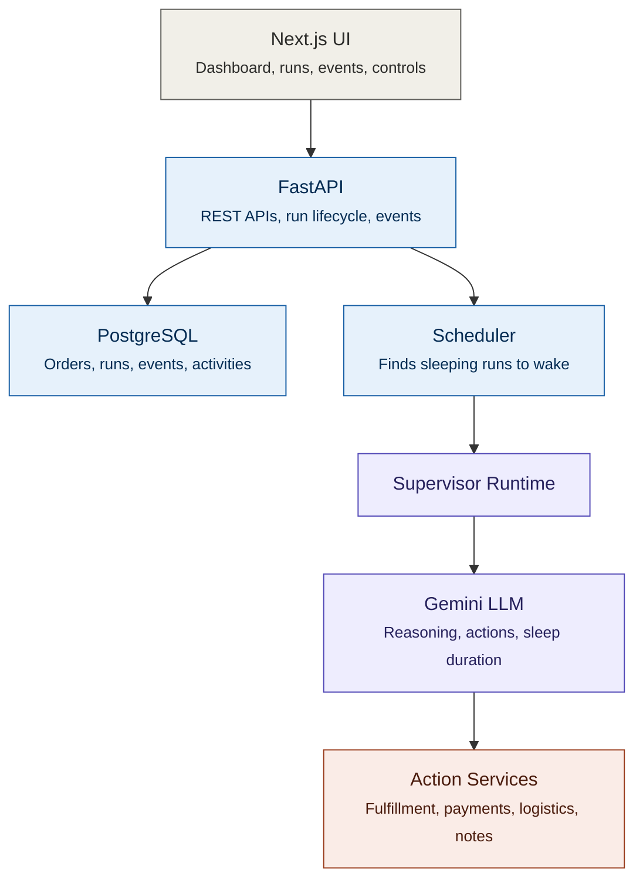

# Order Supervisor

A long-running AI supervisor that monitors a single customer order from creation to completion.

The supervisor reacts to order events, reasons about the current state, performs operational actions, sleeps until the next wake-up, and continues monitoring until the system determines that the run has reached a terminal state.

---

## Architecture

# System Architecture



## Components

- **Next.js UI** — dashboard, run details, event simulator, and run controls.
- **FastAPI** — REST APIs, run lifecycle management, and event processing.
- **PostgreSQL** — stores orders, runs, events, activities, instructions, and run state.
- **Scheduler** — polls for sleeping runs whose wake time has arrived.
- **Supervisor Runtime** — orchestrates the agent loop once a run wakes.
- **Gemini LLM** — does the reasoning, decides on actions, and sets the next sleep duration.
- **Action Services** — fulfillment, payments, logistics, customer contact, and internal notes.

## Flow

1. The UI calls FastAPI to create or update orders and runs.
2. FastAPI persists state to PostgreSQL and hands sleeping runs to the Scheduler.
3. When a run's wake time arrives, the Scheduler triggers the Supervisor Runtime.
4. The Supervisor Runtime calls Gemini, which reasons over the order/run context and decides what to do next — including how long to sleep before waking again.
5. Gemini's chosen actions are dispatched to the relevant Action Service (fulfillment, payments, logistics, customer contact, or an internal note).
---

## How to Run

### Prerequisites

- Python 3.11+
- Node.js
- PostgreSQL
- Gemini API key

### 1. Clone the repository

```bash
git clone <your-github-repository-url>
cd order-supervisor
```

### 2. Start the backend

```bash
cd backend
python -m venv venv
```

**Windows:**

```bash
.\venv\Scripts\Activate.ps1
```

**macOS/Linux:**

```bash
source venv/bin/activate
```

Install dependencies:

```bash
pip install -r requirements.txt
```

Create a `.env` file inside `backend/`:

```env
DATABASE_URL=postgresql://<username>:<password>@localhost:5432/order_supervisor
GEMINI_API_KEY=<your-gemini-api-key>
```

Start the FastAPI server:

```bash
uvicorn app.main:app --reload
```

- Backend: [http://localhost:8000](http://localhost:8000)
- API documentation: [http://localhost:8000/docs](http://localhost:8000/docs)

### 3. Start the frontend

Open another terminal:

```bash
cd frontend
npm install
npm run dev
```

- Frontend: [http://localhost:3000](http://localhost:3000)

---

## Demo Flow

1. Create a new order.
2. Start a supervisor run.
3. Inject `payment_confirmed`.
4. Add a run-specific instruction.
5. Inject `shipment_delayed`.
6. Inspect the supervisor reasoning and activities.
7. Inject `delivered`.
8. The backend completes the run.
9. Inspect the final summary, learnings, and recommendations.

---

## Technology Stack

| Layer     | Technology                                |
|-----------|--------------------------------------------|
| Frontend  | Next.js, React, TypeScript, Tailwind CSS   |
| Backend   | Python, FastAPI, SQLAlchemy                |
| Database  | PostgreSQL                                 |
| AI        | Google Gemini API                          |
| Runtime   | PostgreSQL-backed scheduler                |

---

## Project Structure

```text
order-supervisor/
├── backend/
├── frontend/
├── README.md
├── ARCHITECTURE.md
├── DESIGN.md
└── .gitignore
```